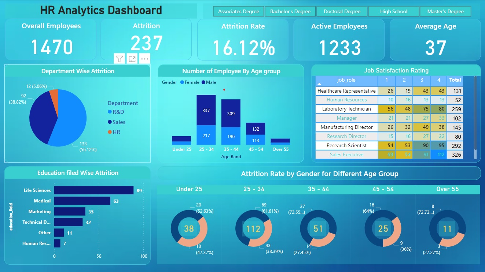

# HR-Analytics-Project

# Project Overview
The HR Analytics Project is a data analysis project that aims to provide insights into HR data using Power BI and MySQL. It utilizes a dataset stored in a MySQL database and visualizes the findings through a Power BI dashboard. By combining these technologies, the project demonstrates the integration of data analytics and visualization for HR purposes.

# Dataset
The dataset used for this project is stored in a MySQL database. It consists of HR-related data such as employee information, performance metrics, and employee satisfaction surveys. The dataset is essential for performing various analyses and generating meaningful visualizations in the Power BI dashboard.

# Files Included
The project includes the following files:

HR_Analytics_Dashboard.pbix: This Power BI file contains the pre-built dashboard that visualizes the HR data. It provides a user-friendly interface to explore and analyze the dataset effectively.

dataset.sql: This SQL script file contains the necessary commands to create the HR dataset in a MySQL database. It includes table structures and sample data to populate the tables for analysis.

queries.sql: This SQL script file contains sample queries that can be executed in MySQL to perform data analysis and verification. These queries can help users gain deeper insights into the HR dataset and cross-verify the information presented in the Power BI dashboard.

# Project Components
The HR Analytics Project consists of the following components:

Data Collection: The HR dataset is collected and stored in a MySQL database. It includes various HR-related data points required for analysis.

Power BI Dashboard: The Power BI dashboard leverages the HR dataset to provide visual representations of the data. It includes interactive charts, graphs, and tables that enable users to explore and understand HR analytics in a user-friendly manner.

MySQL Queries: The project includes sample SQL queries that can be executed in MySQL to analyze and verify the data. These queries serve as a means to perform in-depth analysis and gain insights beyond what is presented in the Power BI dashboard.

# Conclusion
The HR Analytics Project combines the power of Power BI and MySQL to provide a comprehensive analysis of HR data. By utilizing the dataset and the Power BI dashboard, users can gain valuable insights into various HR aspects. The provided SQL queries further enhance the project's capabilities by allowing users to perform custom analyses and verify the data independently.

*Screenshot of Sales Dashboard*
